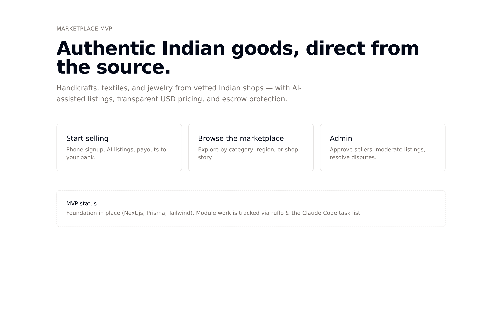
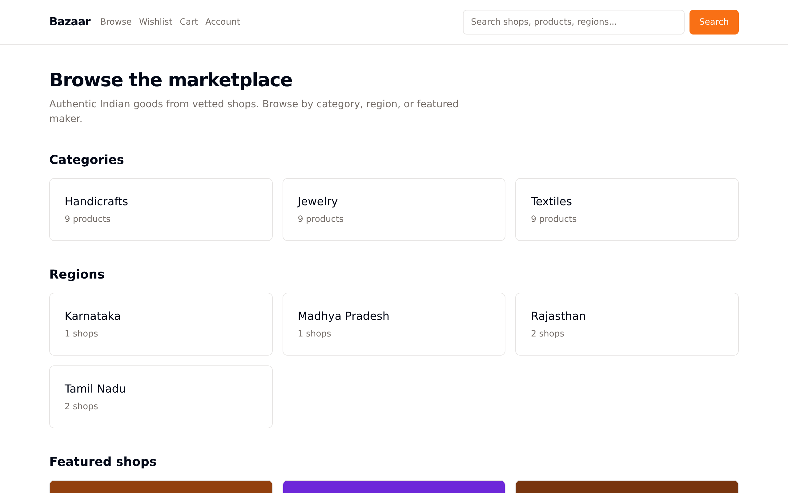
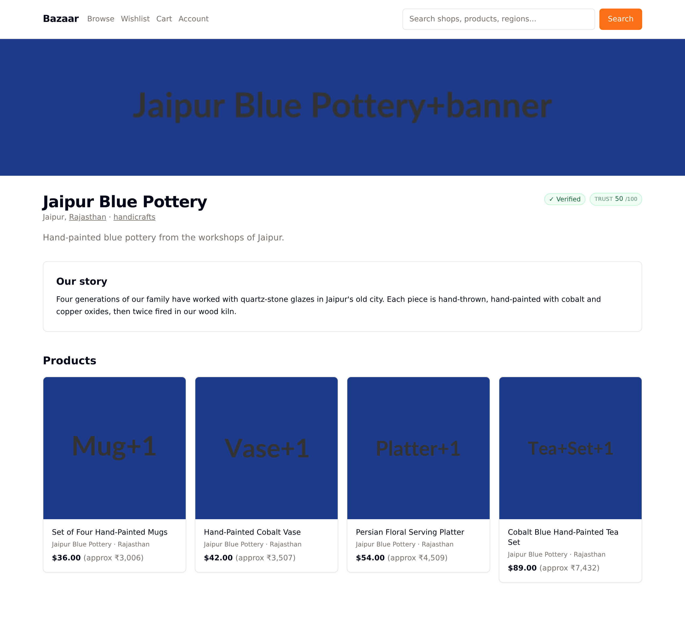
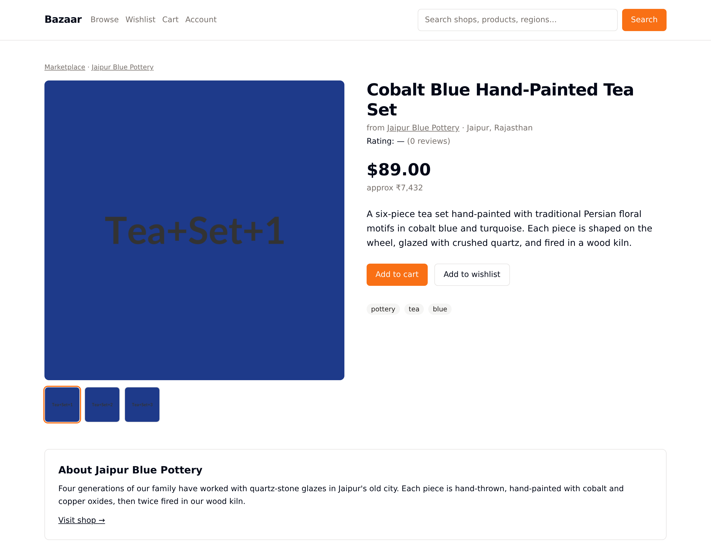
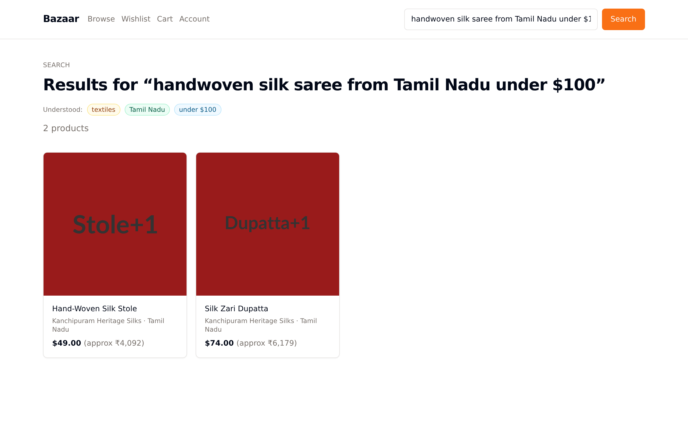
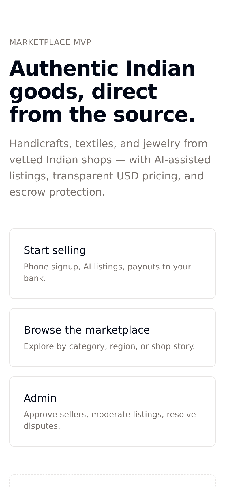
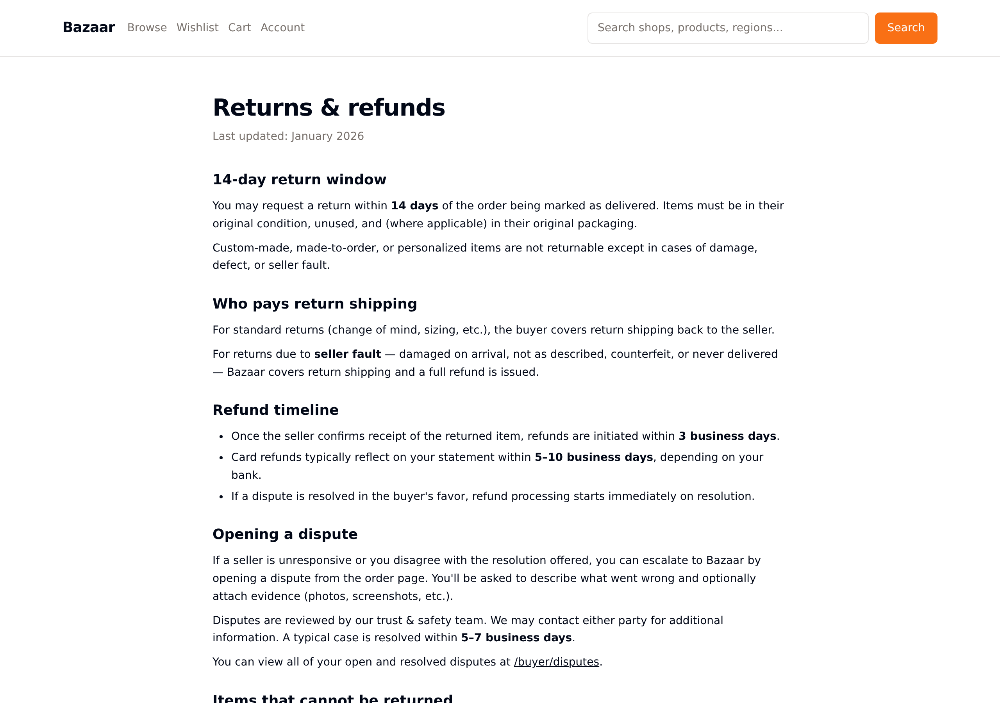

# Marketplace MVP — Status Deck

**A two-sided US ↔ India marketplace for authentic Indian goods**

---

| | |
|---|---|
| **Live URL** | https://amazon-marketplace-sandy.vercel.app |
| **Repo** | github.com/mawadSur/amazon-marketplace |
| **Stage** | MVP deployed to production |
| **Date** | 2026-05-22 |

---

## Executive summary

The US ↔ India two-sided marketplace MVP is **live in production** on Vercel + Neon (Postgres). All seven planned MVP modules shipped, plus five strategic expansions ("cathedral" features) that differentiate the product from commodity marketplaces. **Public browsing works end-to-end on the live URL today**, seeded with 6 vetted shops × 27 products across handicrafts, textiles, and jewelry.

The product story: every product carries the artisan's voice, every checkout shows true landed cost upfront, every shop earns a real-time trust score, and every search reads buyer intent. **Amazon structurally cannot ship this; Etsy can't ship the cross-border logistics + trust infrastructure.** That gap is the moat.

---

## What the client sees today

### Landing page — *the product story, not the marketplace pitch*



### Shop directory — *browse by category, region, or shop*



### Shop storefront — *AI-generated "Our story" panel; trust score visible*

The shop's verified badge sits next to a continuously-recomputed Trust Engine score. The story collage is auto-generated from the seller's bio + product photos — written from their own words, narrated by AI.



### Product detail — *landed cost transparency*

Buyers see item price + INR equivalent + shop provenance. At checkout, the same product shows true landed cost: item + shipping + US import duty (per HS code) + service fee = total. **No surprises at delivery.**



### AI Shopping Concierge — *natural language search*

Query: *"handwoven silk saree from Tamil Nadu under $100"*. Claude parses category (textiles), region (Tamil Nadu), price ceiling ($100), and surfaces results with the interpretation chips at top so the buyer sees what was understood.



### Sign-in — *phone OTP for sellers, mobile-first*

The Indian shop owner audience uses phones, not desktops. Sign-in is single-column, large inputs, OTP-driven, optimized for one-handed use.


### Mobile view — *responsive throughout*



### Returns policy — *visible trust signals*

14-day returns, escrow holds, Buyer Protection coverage auto-enrolled per paid order.



---

## What shipped — the seven MVP modules

| # | Module | Status |
|---|---|---|
| 1 | **Seller onboarding** — phone OTP, GST/PAN/Udyam KYC, Razorpay bank linking, shop profile (<10 min target) | ✅ Live |
| 2 | **AI product generation** — photo upload → bg removal → Claude descriptions → market-aware pricing → auto-categorization | ✅ Live |
| 3 | **Buyer experience** — browse, search, product detail, reviews, wishlist, cart | ✅ Live |
| 4 | **Transaction layer** — Stripe (US payments) + Razorpay (India payouts), escrow until delivery, idempotent webhooks | ✅ Live |
| 5 | **Logistics** — Shiprocket integration, customs docs, two-party tracking pages | ✅ Live |
| 6 | **Trust & safety** — disputes workflow, return policy, fraud signals, Buyer Protection coverage | ✅ Live |
| 7 | **Admin dashboard** — seller approval, AI-listing moderation, dispute resolution, audit log, funnel analytics | ✅ Live |

## What shipped — the five strategic differentiators

| # | Feature | Status | Why it matters |
|---|---|---|---|
| D2 | **AI Shopping Concierge** | ✅ Live | Conversational search parses intent (category, region, price, gift context). The moat — commodity marketplaces can't ship this without an LLM in the loop. |
| D4 | **Customs Pre-Clearance** | ✅ Live | Landed-cost transparency at checkout (item + shipping + duty + service fee). Removes the #1 cross-border friction: surprise duties at delivery. |
| D6 | **Trust Engine** | ✅ Live | Replaces static badges with a continuous 0–100 Authenticity Score per shop. Auto-enrolled Buyer Protection insurance per paid order. |
| D8 | **Smart Pricing** | ✅ Live | When sellers edit a draft, an AI panel shows their position vs market with concrete recommendations from real category comparables. |
| D3 | **Provenance Stories v1** | ✅ Live | Each shop gets an AI-narrated story panel auto-generated from their bio + product photos. Auto-triggered on admin approval. |

---

## Quality bar

- **Production deploy:** Vercel (auto-deploys on every push to master)
- **Database:** Neon serverless Postgres, connection pooling enabled
- **Smoke tests:** 25/26 public-route tests passing on live URL; 16/16 authenticated flow tests passing
- **Unit tests:** 38/38 across pure-function libraries (pricing, customs, trust score, search intent, fees, formatting)
- **Type safety:** TypeScript strict mode, zero compile errors across ~14,000 lines / 145 files
- **Security:** Rate limiting, OTP brute-force lockout, Stripe + Razorpay webhook signature verification, refund dead-letter queue, audit-logged admin actions, role-gated routes

---

## Architecture (one-glance view)

```
                          ┌───────────────────────┐
                          │   Buyer + Seller UI   │
                          │  (Next.js 15 / RSC)   │
                          └────────────┬──────────┘
                                       │
                       ┌───────────────┴───────────────┐
                       │   Vercel — serverless edge    │
                       │   • Pages + Server Actions    │
                       │   • API routes                │
                       └──┬──────────┬───────────┬─────┘
                          │          │           │
              ┌───────────▼┐   ┌─────▼─────┐  ┌──▼──────────────┐
              │  Postgres  │   │  Redis    │  │  S3 / R2        │
              │  (Neon)    │   │ (Upstash) │  │  product photos │
              └────────────┘   └───────────┘  └─────────────────┘
                                       │
                       ┌───────────────┴──────────────┐
                       │  Background worker (Fly.io)  │
                       │  • AI pipeline (4 jobs)      │
                       │  • Refund DLQ                │
                       │  • Provenance Story render   │
                       └───────────────┬──────────────┘
                                       │
                       ┌───────────────┴──────────────┐
                       │      External providers      │
                       │  Stripe • Razorpay •         │
                       │  Shiprocket • Claude API •   │
                       │  Twilio • Sentry             │
                       └──────────────────────────────┘
```

---

## What's deferred to v2 (intentional, not gaps)

| Feature | Why deferred | Revisit when |
|---|---|---|
| **Live Shopping rooms** | Biggest lift (~3 weeks), speculative ROI for first 50 orders | After 50+ active shops + real engagement data |
| **Multi-carrier logistics (DHL / FedEx)** | Single carrier (Shiprocket) sufficient for v1 volume | Single-carrier failure rate >5% or volume >1k/month |
| **Wholesale B2B mode** | Different sales motion (account-managed, NET-30) | After retail validates with ≥1 US boutique asking unprompted |

---

## In progress — the remaining ~5% to first paying transaction

1. **Phone OTP API in production** — same-day fix; debug in flight
2. **Real Stripe / Razorpay / Twilio / Shiprocket / Anthropic API keys** — code is wired to the interfaces; switching to live credentials is a per-provider env-var change
3. **Background worker deployment to Fly.io** — image built, infra config ready
4. **Sentry observability go-live** — instrumentation deployed; needs Sentry project ID

---

## What the client can demo right now

| | Link |
|---|---|
| Home | https://amazon-marketplace-sandy.vercel.app/ |
| Browse marketplace | https://amazon-marketplace-sandy.vercel.app/shop |
| AI Concierge search | https://amazon-marketplace-sandy.vercel.app/search?q=handwoven+silk+saree+from+Tamil+Nadu+under+%24100 |
| Shop with story panel | https://amazon-marketplace-sandy.vercel.app/shop/jaipur-blue-pottery |
| Product detail | https://amazon-marketplace-sandy.vercel.app/products/blue-pottery-tea-set |
| Returns policy | https://amazon-marketplace-sandy.vercel.app/legal/returns |

---

## Next milestones

1. **Resolve OTP production integration** — today
2. **Wire real API keys** for the four payment / messaging / shipping providers (~1 day once keys provided)
3. **Deploy background worker** to Fly.io
4. **Pilot launch** — onboard first 5–10 verified Indian shops, run end-to-end first transactions

---

*Document generated 2026-05-22. Live URL last verified at production-smoke-test 25/26 passing.*
